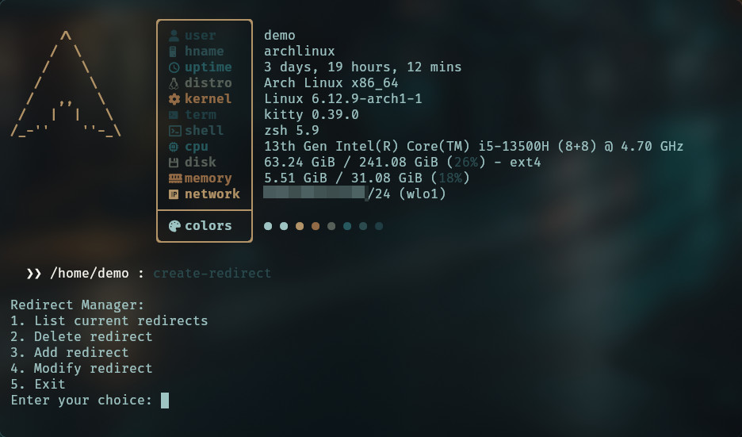

# redirector

This is a simple app that generates redirect documents with custom meta tags. I built it to share links from my company's blog on LinkedIn because the platform wasn’t properly pulling screenshots or metadata from the source material. This app allows me to add my own screenshots and metadata for better presentation and sharing.

## Features

* Generate redirect pages with optimized metadata.
* Customize metadata fields like title, description, author, and image.
* Automatically fetch and save images locally from external URLs.
* Easily manage redirects through a CLI tool:
	- Add new redirects.
	- Modify existing redirects.
	- List all redirects in JSON format.
	- Delete redirects.

## Usage

1. **Run the app:** Run using Docker.

	```bash
	docker compose up -d
	```

2. **Manage redirects:** Use the CLI tool to add, modify or delete redirects.

	```bash
	python cli.py
	```

	

3. **Access Redirects:** Navigate to the route you set up (e.g., https://your-domain.com/my-redirect). The app will render the specified metadata and redirect users to the target URL.

## Favicons

The `/static` directory has `favicon.ico` and `apple-touch-icon.png` images which can be replaced with your own icon.

## Preview

If you want to preview what your links look like on social media apps, [Zeloab has a free tool here](https://www.zelolab.com/free-tools/preview-as).


## Debug

Adding `?debug=true` to the end of your redirect link will disable the automatic redirection, so you can inspect the page if needed.


